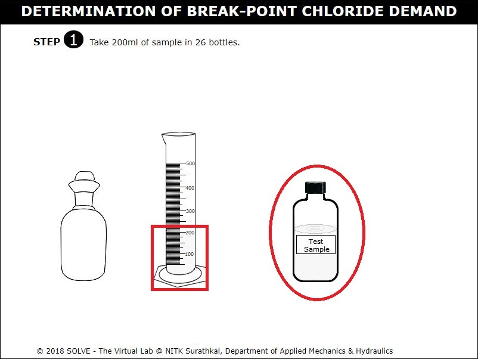

#### These procedure steps will be followed on the simulator

1. When you click on Break-Point Chlorine Demand simulation file, a new window will open as shown below, hover on "Description" and "Solutions used" label to understand the terminologies and reagents used in the experiment. Click on NEXT button to proceed. 
 

2. Click on the bottle containing test sample then take 200ml of sample in 26 bottles. Click on NEXT button to proceed. 
 

3. Answer the question by selecting the correct answer then click on OK to proceed with the simulation. 
 

4. Add standard Chlorine solution to the bottles by clicking on graduated pipette and add Chlorine solution to the bottle in 0.5ml increment, click on NEXT button to proceed. 
 

5. Mix the sample by inverting the bottle and keep all the bottles in dark for 20 minutes. 
 

6. Pour 200ml of sample from each bottles into conical flask. Click on NEXT button to proceed. 
 

7. Click on the graduated pipette to add 5ml of concentrated Sulphuric Acid to the conical flask. 
 

8. Click on the spatula to take 1g Potassium Iodide (KI) crystals then add it to conical flask and stir the flask properly. 
 

9. Click on the bottle containing starch to add 1ml of Starch indicator to conical flask and observe the change in colour of the solution from colourless to very light blue. 
 

10. Click on the 0.0282N Iodine solution bottle to fill the burette with it. 
 

11. Open the knob to titrate the solution against 0.0282N Iodine solution until colour changes from blue to light pink. 
 

12. Observe the colour change from light pink to colourless. 
 

13. With the help of formula used and observations obtained, calculate Residual Chlorine. Click on NEXT button to proceed. 
 

14. Continue the titration procedure for all the remaining samples and obtain the Residual Chlorine value. Click on NEXT button to proceed. 
 

15. With the help of observations obtained, plot the characteristic curve of Chlorine dosage v/s Residual chlorine. Click on NEXT button to proceed. 
 

16. Go through the Inference drawn from the obtained result. 
 
